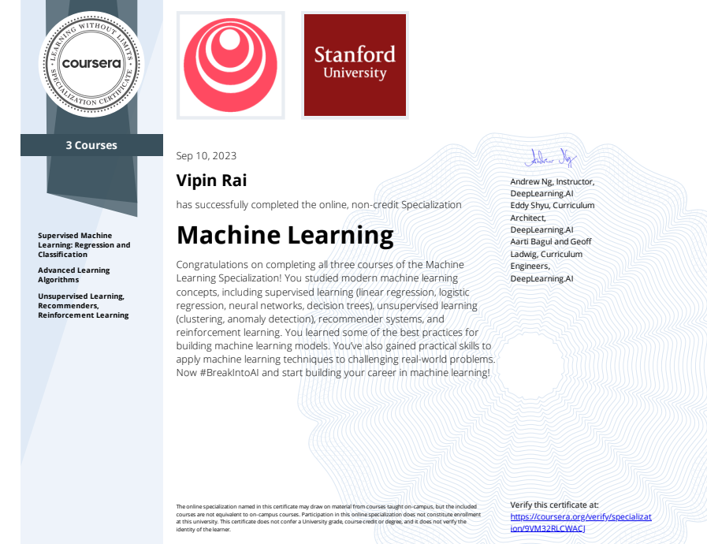

# Machine-Learning-Projects
## Content 
Project 1- [Optimizing Restaurant Expansion: Linear Regression Analysis for Profit Prediction in New Cities](C1_W2_Linear_Regression.ipynb)
  - Summary: As the CEO, a linear regression approach was employed to analyze profits and populations of existing restaurant locations. Utilizing this model, predictions were made for potential cities, enabling strategic decision-making for restaurant expansion by identifying locations likely to yield higher profits based on population data.Summary: As the CEO, a linear regression approach was employed to analyze profits and populations of existing restaurant locations. Utilizing this model, predictions were made for potential cities, enabling strategic decision-making for restaurant expansion by identifying locations likely to yield higher profits based on population data.

Project 2- [University Admission Prediction: Logistic Regression Modeling Based on Exam Scores](C1_W3_Logistic_Regression.ipynb)
  - Summary: As the department administrator, a logistic regression model was developed using historical data from previous applicants. This model predicts an applicant's probability of admission based on their scores in two exams, providing a valuable tool for assessing and making informed decisions on new applicants' likelihood of admission.Summary: As the department administrator, a logistic regression model was developed using historical data from previous applicants. This model predicts an applicant's probability of admission based on their scores in two exams, providing a valuable tool for assessing and making informed decisions on new applicants' likelihood of admission.

Project 3- ["Handwritten Digit Recognition Using Neural Networks on MNIST Dataset](C2_W1_Assignment.ipynb)
- Summary: Employed a neural network for the binary and multiclass classification of handwritten digits (0-1 and 0-9) using the MNIST dataset. This exercise showcases the versatility of automated handwritten digit recognition, applicable in various domains such as postal code recognition on mail envelopes and reading amounts on bank checks.Summary: Employed a neural network for the binary and multiclass classification of handwritten digits (0-1 and 0-9) using the MNIST dataset. This exercise showcases the versatility of automated handwritten digit recognition, applicable in various domains such as postal code recognition on mail envelopes and reading amounts on bank checks.

Project 4- [Anomaly Detection in Server Behavior: Gaussian Model Implementation](C3_W1_Anomaly_Detection.ipynb)
  - Summary: Implemented an anomaly detection algorithm to identify abnormal behavior in server computers using a dataset with throughput and latency features. We initially applied the algorithm to a 2D dataset for visualization, fitting a Gaussian distribution, and identifying low-probability values as anomalies. Later, we extended the approach to a larger dataset with multiple dimensions for comprehensive anomaly detection in server behavior.Summary: Implemented an anomaly detection algorithm to identify abnormal behavior in server computers using a dataset with throughput and latency features. We initially applied the algorithm to a 2D dataset for visualization, fitting a Gaussian distribution, and identifying low-probability values as anomalies. Later, we extended the approach to a larger dataset with multiple dimensions for comprehensive anomaly detection in server behavior.

Project 5- [Image Compression using K-means Algorithm for Color Reduction](C3_W1_KMeans_Assignment.ipynb)
  - Summary: Employed the K-means algorithm for image compression by reducing the number of colors from thousands to 16. Each pixel's RGB values were treated as data examples, and K-means identified 16 cluster centroids in the 3D RGB space. These centroids were then used to replace pixels in the original image, achieving efficient compression while maintaining visual representation.Summary: Employed the K-means algorithm for image compression by reducing the number of colors from thousands to 16. Each pixel's RGB values were treated as data examples, and K-means identified 16 cluster centroids in the 3D RGB space. These centroids were then used to replace pixels in the original image, achieving efficient compression while maintaining visual representation.
  - 
Project 6- [Reinforcement Learning in Lunar Lander Environment](C3_W3_A1_Assignment.ipynb)
  - Summary: Utilizing OpenAI's Gym Library, this project explores solving the Lunar Lander environment through reinforcement learning. The goal was to safely land the lunar lander on the moon's surface, with specific actions and observations defined in the discrete action and observation spaces.Summary: Utilizing OpenAI's Gym Library, this project explores solving the Lunar Lander environment through reinforcement learning. The goal was to safely land the lunar lander on the moon's surface, with specific actions and observations defined in the discrete action and observation spaces.
Skills: Machine LearningSkills: Machine Learning

Project 7  - [Neural Network-Based Content Filtering for Movie Recommendations](C3_W2_RecSysNN_Assignment.ipynb)
  - Summary: Utilized a neural network for content-based filtering in building a movie recommender system using the MovieLens ml-latest-small dataset. The dataset, focusing on movies from 2000 onwards and popular genres, comprises 397 users, 847 movies, and 25,521 ratings.Summary: Utilized a neural network for content-based filtering in building a movie recommender system using the MovieLens ml-latest-small dataset. The dataset, focusing on movies from 2000 onwards and popular genres, comprises 397 users, 847 movies, and 25,521 ratings.

## Certificate

